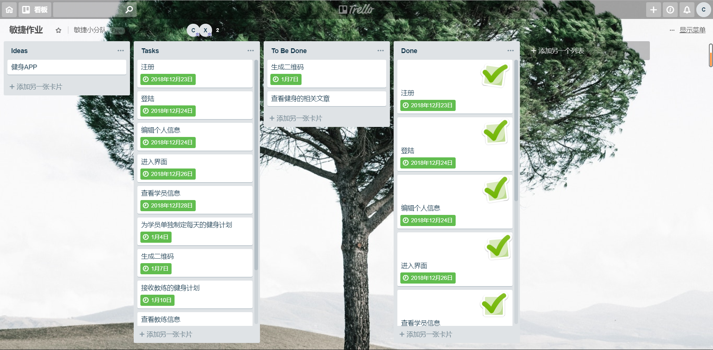
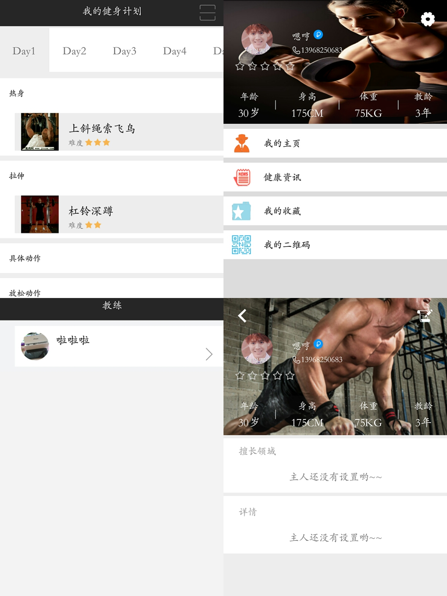

# 一个关于健身的APP

## 简要介绍

> 本系统采用 Android Studio 软件进行设计和开发，
> 在原生开发的基础上， 结合 Bmob 云数据库，在 Android 操作系统上，实现一个传统行业与互联网结合 的运动类型的 APP。
> **目标**：充分考虑整个 APP 的美观性和实用性，以及可扩 展性原则要求，通过合理的模块划分，实现系统代码高内聚低耦合，
> 实现软件技术开发时的灵活性变通能力。

## 实现功能
项目管理截图

### 概要功能模块
* [x] 登陆注册模块
* [x] 教练学员的个人界面模块
* [x] 教练为学员定制计划模块
* [x] 教练通过学员二维码获得学员信息
* [x] 学员通过二维码获得健身计划
* [ ] 绑定健身公众号信息，可浏览
* [ ] 用户可收藏浏览文章

## 目前实现功能的APP操作部分截图

